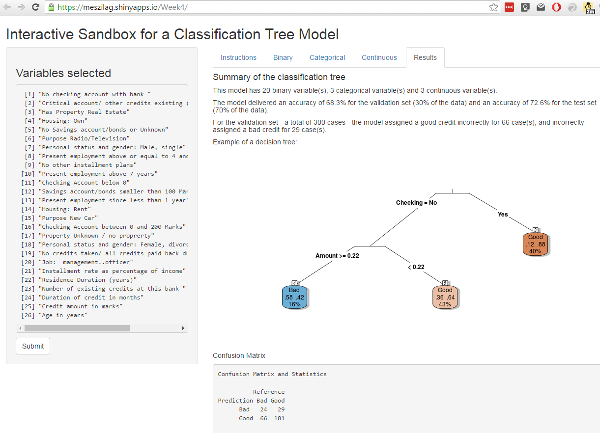

Interactive Sandbox for a Classification Tree Model
========================================================
author: Marcelo Szilagyi 
 
Motivation and Approach
========================================================

This shiny app helps data analysts to perform an initial data analysis and run a [classification tree](https://en.wikipedia.org/wiki/Decision_tree_learning) to test hypothesis for a (binary) classification problem

Users can:

- Navigate between the tabs (one for each type of variable)
- Understand the data using contingency tables and visualizations
- Selecting the variables to be part of the classification tree
- See the models results and refine the model variable selection, by adding or removing variables

Data 
========================================================

The data used for the example is the [German Credit Data](https://archive.ics.uci.edu/ml/datasets/Statlog+(German+Credit+Data)), extracted from the [caret package](http://topepo.github.io/caret/datasets.html).

Results
========================================================
After the proper selection of variables, users can see the decision tree and the confusion matrix: 

App and Code hyperlinks, future developments
========================================================

The app can be found at <https://meszilag.shinyapps.io/week4b/> and the code can be found at <https://github.com/marceloszilagyi/week4b>.

Future developments may include:
- User upload of data files
- Automated creation of visualizations
- Selection of models
